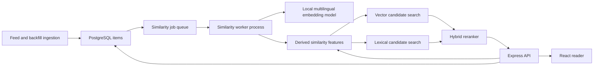

# Similar Articles Architecture

Status: proposed implementation design  
Feature phase: post-v1  
Companion backlog: [Similar Articles Stories](./similar-articles-stories.md)

## 1. Decision Summary

Feedyarder will find similar articles with hybrid retrieval:

1. A local multilingual embedding model retrieves articles with similar meaning.
2. PostgreSQL full-text search retrieves articles that share important exact terms.
3. The API merges and reranks both candidate sets.
4. Low-confidence results, exact duplicates, and repetitive same-feed results are removed.
5. The API returns a bounded top result set rather than claiming an exact corpus-wide count.

Similarity is derived data. It does not change the immutable source fields stored in
`items`.

The embedding model runs in a dedicated process built from `apps/worker`. It does
not run in the feed-fetch cycle or the API process. Article content remains on the
Feedyarder host.

The proposed baseline is:

- Model family: `multilingual-e5-small`
- Runtime: Transformers.js with pinned ONNX model artifacts
- Embedding size: 384 dimensions
- Storage: pgvector `halfvec(384)`
- Distance: cosine distance
- Approximate index: HNSW
- PostgreSQL: version 17 with a pinned pgvector-enabled image

Story SA-01 must validate the baseline model against real Feedyarder articles before
the database migration fixes the vector dimension. If that evaluation rejects the
baseline, this document and `AGENTS.md` must be updated before implementation
continues.

## 2. Product Meaning

For this feature, "similar" means topically related based on the article's title,
summary, and feed-provided body.

The first release uses these product rules:

- Similarity is not based on read history or other behavioral personalization.
- Articles from every feed and folder are eligible.
- Read, unread, and starred state do not affect ranking.
- Same-feed articles are allowed but are penalized and capped in the final list.
- Articles close in publication time receive a small boost, but there is no hard
  date window.
- Exact duplicates are removed.
- Near-identical syndicated copies are collapsed so they do not fill the result
  list.
- Same-event coverage with meaningfully different wording remains eligible.
- Missing `published_at` removes the recency bonus but does not make an article
  ineligible.
- Low-confidence matches are omitted. Zero results is a valid outcome.

The default result limit is five. The public API may accept a limit from 1 through
20.

## 3. Goals

- Find useful related articles even when they do not share exact wording.
- Retain exact-name, product-version, and phrase matching through lexical search.
- Support Feedyarder's multilingual content.
- Keep feed ingestion reliable when embedding generation is slow or unavailable.
- Support approximately 10 million stored items and 1,000 new items per day.
- Make model, preprocessing, and ranking changes observable and reproducible.
- Make an initial historical backfill resumable.
- Keep the design inside the existing Node.js, PostgreSQL, and worker architecture.

## 4. Non-Goals

- Personalized recommendations.
- Collaborative filtering.
- A "trending topics" or topic-clustering product.
- Fetching original article pages for better similarity text.
- LLM-based pairwise judging or reranking.
- An exact count of every qualifying article in the corpus.
- Precomputing and storing neighbor edges for all items.
- Exposing raw similarity scores to the web client.
- Automatically learning ranking weights from user behavior.
- A general-purpose machine-learning service.

## 5. Existing Constraints

The existing system shapes the implementation:

- `items` already stores `title`, `summary_text`, `content_html`, `author`,
  `published_at`, and `raw_extension_data`.
- Items are immutable after ingestion.
- All normal and targeted backfills ultimately insert through the worker repository.
- Search currently uses a functional GIN index over a `simple` PostgreSQL
  `tsvector`.
- The public API is OpenAPI-first and generated Zod schemas validate responses at
  the web boundary.
- The deployed PostgreSQL image is currently plain `postgres:17`; pgvector is not
  installed.
- The feed worker has strict operational responsibilities and must not be delayed by
  model inference.

The current item search index remains unchanged. Similarity receives a separate
derived lexical document because its field weighting, HTML handling, and lifecycle
are different from user-entered search.

## 6. System Context



The similarity worker is a second runtime process from the existing
`@feedyarder/worker` workspace. It uses the worker image and database package but a
separate entry point and Docker Compose service. This keeps one worker application
in the monorepo while isolating CPU- and memory-heavy inference from feed fetching.

## 7. Database Design

### 7.1 PostgreSQL extension and image

Docker Compose will use a pinned pgvector image compatible with PostgreSQL 17,
instead of the floating `postgres:17` image. The migration enables the extension:

```sql
create extension if not exists vector;
```

The PostgreSQL major version remains 17, so the existing data directory format does
not change. Deployment still requires a verified backup before replacing the
database image.

### 7.2 `item_similarity_features`

One derived feature row exists per item for the active implementation:

```sql
create table item_similarity_features (
  item_id uuid primary key references items (id) on delete cascade,
  algorithm_version text not null,
  status text not null check (status in ('ready', 'skipped')),
  input_hash text not null,
  plain_text_length integer not null,
  lexical_terms text[] not null default '{}',
  search_document tsvector not null default ''::tsvector,
  embedding halfvec(384),
  skip_reason text,
  generated_at timestamptz not null default now(),
  check (
    (status = 'ready' and embedding is not null and skip_reason is null)
    or
    (status = 'skipped' and embedding is null and skip_reason is not null)
  )
);
```

Responsibilities:

- `algorithm_version` identifies the complete preprocessing, model, and ranking
  contract, for example `similarity-v1`.
- `input_hash` is SHA-256 over the algorithm version and normalized input text.
- `lexical_terms` holds a bounded list of normalized title/summary terms used to
  construct the lexical candidate query.
- `search_document` is separate from the existing user-search document.
- `embedding` stores the normalized 384-dimensional output in half precision.
- `skipped` records a permanent content condition such as insufficient text. It is
  not used for transient inference failures.

Indexes:

```sql
create index item_similarity_features_search_idx
  on item_similarity_features using gin (search_document);

create index item_similarity_features_embedding_idx
  on item_similarity_features using hnsw
  (embedding halfvec_cosine_ops)
  where status = 'ready';
```

The exact HNSW build parameters remain at pgvector defaults until the scale
benchmark provides evidence for changing them.

### 7.3 `item_similarity_jobs`

The database provides a durable, leased work queue:

```sql
create table item_similarity_jobs (
  item_id uuid primary key references items (id) on delete cascade,
  target_algorithm_version text not null,
  attempt_count integer not null default 0,
  available_at timestamptz not null default now(),
  lease_expires_at timestamptz,
  last_error_category text,
  last_error_message text,
  created_at timestamptz not null default now(),
  updated_at timestamptz not null default now()
);
```

Indexes support claiming available work and reporting queue age:

```sql
create index item_similarity_jobs_available_idx
  on item_similarity_jobs (available_at, created_at, item_id);

create index item_similarity_jobs_lease_idx
  on item_similarity_jobs (lease_expires_at)
  where lease_expires_at is not null;
```

An `AFTER INSERT` trigger on `items` inserts a `similarity-v1` job with
`ON CONFLICT DO NOTHING`. This makes queueing independent of whether the item came
from a normal feed fetch or any targeted backfill.

Successful and permanently skipped work deletes the job. Transient failures leave
the job with a later `available_at`. Therefore the job table contains only
outstanding work instead of growing to one row per historical item forever.

An explicit CLI command seeds jobs for items that existed before the trigger:

```text
npm run similarity:enqueue -- --all --newest-first
```

The command is idempotent and inserts in bounded batches.

### 7.4 Model upgrades

The first implementation supports one served algorithm version at a time.

A model or preprocessing change requires:

1. Define a new algorithm version in source.
2. Update the insert trigger's target version in a migration.
3. Enqueue existing items for the new target version.
4. Recompute features newest-first.
5. Activate the new API version only after its measured coverage and quality pass
   the rollout gate.

Feature rows are replaced only after successful inference, so failed work does not
destroy the previously computed vector. Supporting multiple simultaneously served
vector dimensions is deliberately deferred.

## 8. Similarity Text Construction

The worker builds deterministic text from fields already stored on the item:

1. Normalize the title.
2. Normalize the summary.
3. Parse `content_html` with `parse5`.
4. Remove non-content elements such as `script`, `style`, `template`, and SVG
   metadata.
5. Extract visible text and decode entities.
6. Collapse Unicode whitespace and control characters.
7. Remove a summary or title segment when it is already repeated verbatim at the
   beginning of the body.
8. Compose title, summary, and body in that order.

The title and summary must survive model truncation. Body text is appended last and
is truncated by the pinned model tokenizer to its supported token limit.

The first version excludes:

- feed title
- folder title
- author
- URL
- generic enclosure data
- unreviewed `raw_extension_data`

Those values often describe the publisher or recurring series rather than the
article topic. Specific normalized categories or tags may be added in a later
algorithm version after evaluation.

An item is permanently skipped when no meaningful text remains. The exact
minimum-token rule is versioned and tested. A short but informative title must not
be skipped merely because it has few characters.

### 8.1 Lexical feature construction

The similarity search document uses field weights:

- title: weight A
- summary: weight B
- cleaned body: weight D

The document uses the PostgreSQL `simple` configuration because Feedyarder contains
multiple languages. The worker also creates a bounded list of lexical terms from
the title and summary:

- normalized Unicode word tokens
- duplicate terms removed
- punctuation-only tokens removed
- a small versioned multilingual stopword list applied
- at most 16 terms
- title terms selected before summary terms

This is intentionally not a new general search engine. It exists to recover exact
names, acronyms, versions, and phrases that semantic vectors can blur.

## 9. Embedding Generation

### 9.1 Runtime

The baseline implementation uses Transformers.js in Node.js. A pinned ONNX revision
of `multilingual-e5-small` is loaded once at similarity-worker startup and reused
for all batches.

The model artifacts are stored in a persistent Docker volume. The deployment
downloads only the pinned model revision when the cache is empty. Article content
is never sent to Hugging Face or another external inference provider. Production
may disable remote model loading after the cache has been prepared.

The model contract includes:

- exact model repository and immutable revision
- tokenizer revision and maximum length
- input prefix policy
- pooling strategy
- output normalization
- embedding dimension
- quantized or unquantized ONNX artifact

These settings are part of `algorithm_version`, not ad hoc environment options.

### 9.2 Worker loop

The similarity worker:

1. Atomically claims a bounded job batch by setting `lease_expires_at`.
2. Loads item source fields for the claimed IDs.
3. Builds normalized text and lexical features.
4. Marks insufficient-text items as `skipped`.
5. Embeds valid texts in a bounded inference batch.
6. Verifies vector dimension and finite numeric values.
7. Upserts feature rows and deletes completed jobs in a transaction.
8. Releases or reschedules failed jobs.

Claiming uses `FOR UPDATE SKIP LOCKED` inside a short transaction. No database
transaction remains open while the model runs.

Expired leases are eligible for another worker. This allows restart recovery
without a separate queue service.

### 9.3 Retry behavior

Transient failures use exponential backoff capped at 24 hours and continue retrying.
Examples include process termination, temporary model-loading failures, and
database connectivity failures.

Permanent item conditions become `skipped`. Programming errors, vector dimension
mismatches, and model checksum failures are not silently skipped; they remain
visible as failed jobs and structured errors.

Operational controls:

- enable/disable similarity processing
- batch size
- poll interval
- lease duration
- maximum CPU-oriented worker concurrency
- optional backfill rate limit
- local model cache path

Quality parameters and the algorithm version are constants committed in source so
operators cannot accidentally change ranking semantics through environment drift.

## 10. Candidate Retrieval

The endpoint loads the source item's current feature row. If it is pending,
skipped, or absent, the endpoint returns the corresponding availability state
without running a corpus scan.

For a ready source item, the API requests two bounded candidate lists.

### 10.1 Semantic candidates

The vector query:

- filters to `status = 'ready'`
- filters to the active `algorithm_version`
- excludes the source item
- orders by cosine distance
- returns at most 150 candidates
- includes distance, feed ID, URL, publication time, and normalized title data

The HNSW index supplies approximate nearest neighbors. A model-specific maximum
distance removes candidates that are too weak before reranking.

### 10.2 Lexical candidates

The API converts the source's validated `lexical_terms` to an OR `tsquery`. It then:

- searches the GIN-indexed similarity document
- excludes the source item
- requires the active algorithm version
- ranks with `ts_rank_cd`
- returns at most 150 candidates

Lexical retrieval is skipped when the source has no useful terms.

### 10.3 Candidate boundaries

Candidate limits are hard bounds, not pagination limits. Retrieval must not rank an
unbounded match set in application memory.

No read/star/folder filter is applied. Paused feeds remain eligible because pausing
a subscription does not invalidate its stored articles.

## 11. Hybrid Ranking

Semantic and lexical score scales are not directly comparable. The API combines
their ranks with weighted reciprocal rank fusion:

```text
baseScore =
  semanticWeight / (rrfConstant + semanticRank)
  + lexicalWeight / (rrfConstant + lexicalRank)
```

A missing rank contributes zero. Initial weights, the RRF constant, and the
semantic cutoff come from SA-01 and SA-09 evaluation and are committed as part of
`similarity-v1`.

The base score is adjusted with bounded rules:

- a small bonus for nearby publication dates
- a small penalty for the same feed
- no date adjustment when either publication date is missing

The recency adjustment can change ordering among already-related candidates but
cannot rescue a candidate that failed the semantic and lexical quality cutoffs.

Final selection applies:

1. Remove exact canonical-URL duplicates.
2. Collapse normalized-title near-duplicate clusters.
3. Keep at most two results from one feed.
4. Require the calibrated final confidence threshold.
5. Return `limit + 1` qualified results internally so `hasMore` can be derived.
6. Break ties deterministically by publication date and item ID.

Only the top `limit` items are returned. Raw component and final scores stay
server-side for diagnostics.

## 12. API Contract

Add an authenticated endpoint:

```http
GET /items/{id}/similar?limit=5
```

Proposed response:

```json
{
  "status": "ready",
  "count": 5,
  "hasMore": true,
  "items": [
    {
      "id": "9d334752-5252-4130-b341-31be4f4b180e",
      "feedId": "c0774fae-e044-490d-aac5-1f90d8bf7ca2",
      "feedTitle": "Example Feed",
      "title": "A related article",
      "url": "https://example.com/related",
      "author": null,
      "summaryText": "Summary",
      "contentHtml": "<p>Summary</p>",
      "publishedAt": "2026-07-28T10:00:00.000Z",
      "isRead": false,
      "isStarred": false,
      "createdAt": "2026-07-28T10:05:00.000Z"
    }
  ]
}
```

`status` values:

- `ready`: source features exist; zero or more qualified results were evaluated
- `pending`: the source is waiting for feature generation or regeneration
- `unavailable`: the source was permanently skipped or similarity is disabled

`count` is `items.length`. It is a bounded returned count, not the number of all
articles beyond the candidate window. `hasMore` means at least one additional
qualified candidate was found in the bounded retrieval set.

UI counter semantics:

- `count = 4`, `hasMore = false` renders as `Similar (4)`
- `count = 5`, `hasMore = true` renders as `Similar (5+)`
- pending and unavailable states do not render a misleading zero

Errors:

- `400` for an invalid UUID or limit
- `401` when unauthenticated
- `404` when the source item does not exist

The response reuses `ItemResponse` so the reader has the content and state needed
to open a selected similar item without inventing a second item shape.

The OpenAPI document remains the source of truth, followed by generated contract
artifacts and API-boundary runtime validation in the web app.

## 13. Reader Integration Boundary

The web app must not request similarity for every collapsed row. That would create
an N+1 query and inference-status problem while the user scrolls.

The initial UI behavior is:

1. Expand an article.
2. Request its similar items once.
3. Show a loading state inside the expanded article.
4. Show the bounded counter/list when ready.
5. Hide the section when there are zero results or the feature is unavailable.
6. Treat selecting a similar item like selecting any other reader item, preserving
   established read/star and single-expanded-item behavior.

Client-side caching may retain the endpoint response for the current session. The
server does not materialize neighbor lists in v1.

## 14. Cache Decision

No database similarity-result cache or precomputed item-to-item edge table is added
initially.

Reasons:

- The application is single-user and request volume is low.
- HNSW and GIN already bound candidate retrieval.
- Cached neighbor sets become stale as roughly 1,000 new items arrive daily.
- Ten neighbors for 10 million items would create 100 million directed edges.
- A cache would complicate algorithm versioning before latency is measured.

If the endpoint misses its latency target, add a versioned, expiring cache only for
items the user opens. That decision requires profiling evidence and a separate
story.

## 15. Capacity and Performance

Raw vector storage for 10 million 384-dimensional half-precision vectors is
approximately:

```text
10,000,000 × 384 × 2 bytes = 7.68 GB
```

This excludes row, table, WAL, and HNSW index overhead. The HNSW index can be
substantially larger than the raw vectors and must be measured on representative
hardware.

Initial targets:

- Similarity API warm p95: at most 500 ms on the deployed dataset.
- Similarity API warm p99: at most 1.5 seconds.
- Incremental queue lag: under one hour at 1,000 new items/day.
- Candidate lists: no more than 150 semantic plus 150 lexical candidates.
- Feed fetch throughput: no measurable regression attributable to inference.
- API process: no model loaded and no inference memory consumption.

The historical backfill runs newest-first, is pausable, and is rate-limited. It can
take days or longer without blocking feature availability for newly ingested
items.

If the full 10-million-item HNSW working set is not affordable, the first
optimization experiment is half-vector binary quantization with exact reranking of
a bounded shortlist. IVFFlat is a second candidate. Neither is introduced until
measurements require it.

## 16. Observability and Operations

Every similarity-worker batch logs structured fields:

- target algorithm version
- claimed count
- ready count
- skipped count
- failed count
- model-load duration
- preprocessing duration
- inference duration
- database-write duration
- oldest outstanding job age

Individual failures log:

- item ID
- attempt count
- error category
- safe error message
- next retry time

Logs must not contain article bodies, embeddings, session data, or database
credentials.

Provide an operator command:

```text
npm run similarity:status
```

It reports:

- total items
- ready features for the active version
- skipped items
- pending jobs
- leased jobs
- retrying jobs
- oldest pending job
- percentage coverage

The existing feed-cycle Telegram summary is not overloaded with one line per
similarity item. A later aggregate alert may report sustained queue failures or
stalled coverage.

## 17. Failure Modes

| Failure | Behavior |
| --- | --- |
| Model cannot load | Similarity worker fails visibly; feed worker and API remain available |
| Model download unavailable | Existing cache continues working; empty cache produces a clear startup error/retry |
| Similarity worker stops | Jobs remain durable and expired leases become claimable |
| One malformed article | Item is skipped only for a permanent input condition; other jobs continue |
| Database unavailable | Job is not acknowledged and is retried after recovery |
| Source feature pending | API returns `pending` without scanning items |
| Source feature skipped | API returns `unavailable` |
| No strong candidates | API returns `ready` with an empty list |
| Partial historical coverage | Results use ready candidates; coverage grows without API schema changes |
| Ranking/model version mismatch | API ignores non-active feature rows and reports pending |
| HNSW recall is insufficient | Compare against exact search on a sample, tune, or change index strategy |

## 18. Security and Privacy

- The endpoint uses the existing single-user session authentication.
- UUID and limit parameters are validated with Zod.
- SQL remains parameterized.
- Article text is processed locally.
- Only model files are downloaded externally.
- Raw embeddings and internal scores are not exposed in the public contract.
- Diagnostic output avoids article content.

## 19. Testing Strategy

### Unit tests

- HTML-to-text normalization and removal of non-content elements
- Unicode whitespace and duplicate segment handling
- deterministic input hashing
- tokenizer truncation order
- lexical term selection and stopword behavior
- insufficient-text classification
- vector validation
- job lease, retry, and backoff calculations
- reciprocal-rank fusion
- recency adjustment
- exact URL and near-title duplicate suppression
- per-feed result cap
- bounded count and `hasMore`

### Database integration tests

- pgvector extension and migration up/down behavior
- item insert trigger creates one idempotent job
- concurrent workers cannot claim the same unexpired job
- expired leases are reclaimed
- feature upsert and job deletion are atomic
- cascade deletion removes jobs and features
- HNSW cosine query excludes the source
- GIN lexical query respects the active version
- endpoint behavior for ready, pending, skipped, empty, and missing items

### Contract tests

- OpenAPI generation remains clean
- web API-boundary parsing accepts every status
- response `count` equals returned item length
- limit validation is shared between contract and API

### Relevance tests

A committed evaluation fixture contains at least 100 stratified source items and
human judgments for candidate relevance:

- strong match
- useful match
- weak match
- irrelevant
- duplicate

The report compares lexical-only, semantic-only, and hybrid results using:

- precision at 5
- nDCG at 5
- percentage with at least one useful result
- irrelevant-result rate
- duplicate rate
- feed diversity
- no-result rate
- query latency

Ranking thresholds are chosen from this report rather than copied from another
model or product.

## 20. Rollout

1. Build the offline evaluator and approve the model/preprocessing contract.
2. Back up PostgreSQL and switch to the pinned pgvector PostgreSQL 17 image.
3. Apply extension, feature, queue, index, and trigger migrations.
4. Deploy the similarity worker disabled.
5. Prepare and verify the pinned local model cache.
6. Enable incremental processing for new items.
7. Enqueue a recent newest-first historical slice.
8. Run relevance, recall, storage, and latency checks.
9. Calibrate thresholds and freeze `similarity-v1`.
10. Expose the API endpoint.
11. Expand the historical backfill in controlled batches.
12. Add the reader UI only after the endpoint passes the quality gate.

Rollback disables the similarity worker and endpoint first. Derived tables and
model storage may then be removed through the down migration without changing
source items.

## 21. Deferred Decisions

These require real measurements:

- HNSW parameter changes
- binary quantization or IVFFlat
- a database result cache
- exact multilingual stopword coverage
- including normalized source-specific categories/tags
- cross-language diversity rules
- aggregate Telegram alerts
- model replacement or a larger embedding dimension
- user feedback such as "not similar"

## 22. References

- [PostgreSQL 17 full-text controls and ranking](https://www.postgresql.org/docs/17/textsearch-controls.html)
- [PostgreSQL 17 preferred full-text indexes](https://www.postgresql.org/docs/17/textsearch-indexes.html)
- [pgvector](https://github.com/pgvector/pgvector)
- [Transformers.js server-side inference in Node.js](https://huggingface.co/docs/transformers.js/main/tutorials/node)
- [`multilingual-e5-small` model card](https://huggingface.co/intfloat/multilingual-e5-small)
- [Transformers.js-compatible `multilingual-e5-small` ONNX model](https://huggingface.co/Xenova/multilingual-e5-small)
