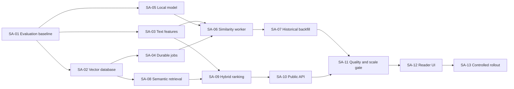

# Similar Articles Story Split

Architecture: [Similar Articles Architecture](./similar-articles-architecture.md)

## Epic

As the Feedyarder owner, I want to see a short, trustworthy list of articles
related to the article I am reading so that I can discover prior or alternative
coverage without manually searching.

The epic is complete when:

- newly ingested articles receive similarity features asynchronously
- historical items can be backfilled without stopping normal feed fetches
- the API returns a bounded, confidence-filtered hybrid result set
- the reader displays similar articles only for the expanded item
- weak results are omitted
- the feature is observable and recoverable
- relevance and latency pass an explicit pre-UI quality gate

## Delivery Shape

T-shirt sizes are relative complexity indicators, not time estimates.

| Story | Outcome | Size | Depends on |
| --- | --- | --- | --- |
| SA-01 | Relevance corpus, evaluator, and baseline decision | L | none |
| SA-02 | pgvector PostgreSQL and feature storage | M | SA-01 |
| SA-03 | Deterministic similarity text and lexical features | M | SA-01 |
| SA-04 | Durable job queue and queue operations | M | SA-02 |
| SA-05 | Pinned local embedding runtime | M | SA-01 |
| SA-06 | Isolated incremental similarity worker | L | SA-02–SA-05 |
| SA-07 | Resumable historical backfill | M | SA-04, SA-06 |
| SA-08 | Bounded semantic candidate retrieval | M | SA-02, SA-06 |
| SA-09 | Lexical retrieval and hybrid reranking | L | SA-03, SA-08 |
| SA-10 | Authenticated OpenAPI endpoint | M | SA-09 |
| SA-11 | Quality, recall, storage, and latency gate | L | SA-07, SA-10 |
| SA-12 | Similar-articles reader interaction | L | SA-10, SA-11 |
| SA-13 | Controlled production rollout and full backfill | M | SA-11, SA-12 |

## SA-01 — Build the Relevance Evaluator and Select the Baseline

**User story**

As the product owner, I want candidate approaches compared on real Feedyarder
articles so that the system is optimized for this corpus rather than generic model
benchmarks.

**Scope**

- Create a repeatable CLI that exports or loads a stratified article sample.
- Include at least 100 anchor items spanning:
  - long and short articles
  - podcasts
  - YouTube entries
  - Reddit posts
  - technical writing
  - general news
  - English, Ukrainian, Russian, and other present languages
  - missing summary/body cases
- Implement three offline strategies:
  - lexical-only baseline
  - semantic-only baseline
  - hybrid baseline
- Produce a review artifact showing each anchor and its top candidates.
- Capture owner judgments: strong, useful, weak, irrelevant, or duplicate.
- Record the exact candidate model, ONNX revision, input prefix, pooling,
  normalization, tokenizer limit, and embedding dimension.

**Acceptance criteria**

- The evaluator is deterministic for the same data, configuration, and model
  revision.
- No article content is sent to a hosted inference API.
- At least 100 anchors are available for review.
- Results include the source feed, candidate feed, dates, titles, strategy, and
  internal scores.
- The evaluator reports precision@5, nDCG@5, useful-match coverage, irrelevant rate,
  duplicate rate, feed diversity, no-result rate, and runtime.
- The owner can review candidates without reading database IDs or raw vectors.
- The selected baseline and rejected alternatives are documented.
- The selected embedding dimension is known before SA-02 starts.

**Testing**

- Fixture tests prove deterministic ordering and metric calculations.
- A fixed miniature corpus detects accidental changes to preprocessing or scoring.
- Model output tests validate finite, normalized vectors of the expected dimension.

**Delivery note**

The architecture assumes `multilingual-e5-small` and 384 dimensions. SA-01 may
change that choice. If it does, update the architecture and project memory before
starting SA-02.

## SA-02 — Add Vector-Capable PostgreSQL and Feature Storage

**User story**

As the system, I need indexed vector and lexical feature storage so that similarity
candidates can be retrieved without scanning all items.

**Scope**

- Replace the floating plain PostgreSQL image with a pinned pgvector PostgreSQL 17
  image.
- Add a versioned up/down migration that:
  - enables `vector`
  - creates `item_similarity_features`
  - creates the GIN lexical index
  - creates the partial HNSW cosine index
- Keep all source item fields unchanged.
- Document backup and image-switch requirements.

**Acceptance criteria**

- Existing PostgreSQL 17 data starts successfully under the pinned compatible
  image in a tested deployment copy.
- Migration `up`, `down`, and `status` work through the existing migration runner.
- Feature rows cascade-delete with their item.
- A 384-dimensional vector can be inserted and retrieved.
- A wrong-dimension or non-finite vector is rejected.
- Cosine nearest-neighbor ordering is demonstrated by an integration test.
- Lexical `tsvector` lookup uses its GIN index on a representative test query.
- No vector or feature data is added to `items`.

**Testing**

- Migration integration tests.
- `EXPLAIN` assertions or inspected plans for vector and lexical retrieval.
- Rollback test on an isolated database.

## SA-03 — Build Deterministic Similarity Text and Lexical Features

**User story**

As the similarity system, I need clean, stable article text so that markup and feed
boilerplate do not dominate topic matching.

**Scope**

- Add a similarity preprocessing module in the worker workspace.
- Convert feed HTML to plain text with the existing HTML parser.
- Remove non-content elements and normalize Unicode whitespace.
- Deduplicate repeated title/summary/body prefixes.
- Preserve title and summary before body truncation.
- Build the weighted similarity `tsvector` inputs.
- Select at most 16 lexical terms from title and summary.
- Produce the versioned input hash.
- Identify insufficient-text items.

**Acceptance criteria**

- Identical item fields produce byte-for-byte identical normalized text, terms, and
  hash.
- Scripts, styles, SVG metadata, and markup do not enter model text.
- Title and summary are retained when long bodies are truncated.
- A short informative title is accepted.
- Empty or meaningless content returns a typed `insufficient_text` outcome.
- Feed name, folder name, author, URL, and arbitrary extension JSON are excluded.
- Multilingual text and emoji do not cause malformed output.
- The module has no database or model-runtime dependency.

**Testing**

- Recorded RSS/Atom and backfill fixtures.
- Malformed HTML fixtures.
- Unicode and mixed-language cases.
- Repeated summary/body cases.
- Extremely long body and empty-content cases.

## SA-04 — Add the Durable Similarity Job Queue

**User story**

As an operator, I want similarity work to survive restarts and failures so that
feature generation can recover without manual bookkeeping.

**Scope**

- Add `item_similarity_jobs` in a versioned migration.
- Add the item-insert trigger that queues `similarity-v1`.
- Implement repository operations to:
  - claim a bounded batch
  - renew or expire leases
  - complete jobs
  - skip permanent item conditions
  - reschedule transient failures
- Add idempotent enqueue and status commands.

**Acceptance criteria**

- Every newly inserted item creates at most one outstanding job.
- Normal feed and targeted backfill insert paths require no source-specific queue
  logic.
- Two concurrent claimers cannot receive the same unexpired job.
- An expired lease becomes claimable.
- A completed job is removed only after its feature row is committed.
- Retry delay increases exponentially and caps at 24 hours.
- `similarity:enqueue --all --newest-first` can be interrupted and rerun safely.
- `similarity:status` reports total coverage, skipped features, pending jobs, leased
  jobs, retrying jobs, and oldest job age.
- Item deletion cascades to outstanding jobs.

**Testing**

- PostgreSQL concurrency integration tests.
- Lease-expiry tests with a controllable clock where practical.
- Idempotent trigger and enqueue tests.
- Transaction rollback test between feature write and job completion.

## SA-05 — Integrate the Pinned Local Embedding Model

**User story**

As the system owner, I want embeddings generated locally from a pinned model so that
article content remains private and results are reproducible.

**Scope**

- Add Transformers.js to the worker workspace.
- Implement one embedding adapter for the SA-01-selected model.
- Pin the model and tokenizer to an immutable revision.
- Configure the exact prefix, pooling, normalization, truncation, and quantization
  contract.
- Persist model files in a dedicated Docker volume/cache.
- Verify model artifacts at startup.
- Support a production mode that forbids unplanned remote model loading.

**Acceptance criteria**

- The adapter returns finite normalized vectors of exactly the selected dimension.
- A batch and the same items embedded individually produce equivalent results
  within documented numeric tolerance.
- Model loading occurs once per process.
- The worker can restart using only the prepared local cache.
- A missing or invalid cache produces a clear categorized failure.
- Article content is not sent over the network.
- Model identity and revision appear in startup logs; article text does not.
- The API and feed-worker entry points do not import or initialize the model.

**Testing**

- Golden embedding metadata test using a small fixed fixture.
- Dimension, normalization, and deterministic-similarity tests.
- Missing cache and invalid revision tests.
- Network-disabled cached-startup test.

## SA-06 — Run Incremental Similarity Processing in an Isolated Worker

**User story**

As the feed reader owner, I want new articles to become similarity-searchable
without slowing or destabilizing feed fetching.

**Scope**

- Add a dedicated similarity-worker entry point in `apps/worker`.
- Add a separate Docker Compose service using the existing worker image.
- Implement the claim, preprocess, embed, validate, persist, and acknowledge loop.
- Add bounded batching, graceful shutdown, retry handling, and structured logs.
- Keep the feed worker process unchanged except for shared database effects from
  the item trigger.

**Acceptance criteria**

- Inserting an item eventually produces a ready or skipped feature row.
- A similarity-worker crash during inference does not lose the job.
- Restarting reclaims expired work without duplicate feature rows.
- One bad item does not fail the rest of its batch.
- Disabling or stopping the similarity worker has no effect on feed fetch cycles.
- The worker respects batch size, poll interval, lease duration, and rate-limit
  operational controls.
- Successful feature generation stores the active algorithm version and input hash.
- Structured logs include batch timing and counts but no article body or vector.
- At 1,000 representative new items/day, queue lag remains below one hour on target
  hardware.

**Testing**

- End-to-end worker integration test with a small local model fixture or deterministic
  test adapter.
- Crash/restart and lease-reclaim test.
- Mixed success/skip/failure batch test.
- Feed-worker regression test showing no model initialization.

## SA-07 — Backfill Historical Item Features Safely

**User story**

As an operator, I want to process existing articles incrementally so that recent
history becomes useful first and a large archive does not disrupt the live reader.

**Scope**

- Complete the historical enqueue command for bounded, newest-first batches.
- Add pause/resume behavior through idempotent queue state.
- Add optional date and item-count limits for staged rollouts.
- Add configurable backfill rate limiting.
- Report coverage and estimated remaining work without promising a completion time.
- Document index-build and vacuum considerations.

**Acceptance criteria**

- Newest items are enqueued before older items.
- Re-running a partially completed command does not duplicate outstanding jobs.
- Operators can enqueue:
  - all missing items
  - items newer than a supplied date
  - a bounded number of missing items
- Incremental new-item jobs are not starved by historical work.
- Backfill can be stopped and resumed without losing completed features.
- Progress is visible through `similarity:status`.
- Feed fetching and API health remain normal during a representative backfill.
- The command exits non-zero on an unrecoverable enqueue failure.

**Testing**

- Ordering and idempotency integration tests.
- Mixed ready, pending, skipped, and outdated-version fixtures.
- Interleaving new ingestion with historical enqueue.

## SA-08 — Retrieve Bounded Semantic Candidates

**User story**

As the API, I need a fast bounded nearest-neighbor query so that opening an article
does not compare it against the entire archive.

**Scope**

- Add a similarity repository in the API workspace.
- Load source feature availability.
- Retrieve at most 150 HNSW cosine candidates for the active version.
- Apply the model-specific semantic cutoff.
- Fetch only fields needed for reranking and final item mapping.
- Add an exact-search comparison utility for recall testing.

**Acceptance criteria**

- The source item never appears in its candidate set.
- Pending, skipped, absent, and outdated source features are distinguished.
- Only ready features from the active version are candidates.
- The query returns no more than the configured candidate bound.
- The query plan uses the HNSW index on representative data.
- Ordering is deterministic after distance ties are resolved.
- Exact-search comparison reports recall@K for a sample.
- Repository tests do not require model inference.

**Testing**

- Database integration tests with known vectors.
- Source state tests.
- Candidate-bound and cutoff tests.
- Approximate-versus-exact recall fixture.

## SA-09 — Add Lexical Retrieval and Hybrid Reranking

**User story**

As a reader, I want related results to preserve exact names and versions while also
matching broader meaning.

**Scope**

- Build a validated OR `tsquery` from stored source lexical terms.
- Retrieve at most 150 GIN-backed lexical candidates.
- Merge semantic and lexical ranks with reciprocal rank fusion.
- Add bounded recency and same-feed adjustments.
- Remove exact URL duplicates.
- Collapse near-identical normalized titles.
- Limit the final list to two items per feed.
- Apply calibrated confidence cutoffs.
- Return `limit + 1` internally to determine `hasMore`.

**Acceptance criteria**

- Semantic-only, lexical-only, and dual-listed candidates are handled.
- Lexical query construction cannot inject arbitrary `tsquery` syntax.
- No unbounded candidate list is loaded into application memory.
- Recency cannot promote a candidate that failed relevance cutoffs.
- Missing dates are neutral.
- Exact duplicate URLs appear at most once.
- Near-identical copies do not fill the final list.
- Same-event articles with meaningfully different wording remain eligible.
- At most two returned items share a feed.
- Zero results is returned when all candidates are below threshold.
- Ties resolve deterministically.
- Internal scores are available to evaluator diagnostics but not public responses.

**Testing**

- Pure unit tests for rank fusion and every adjustment.
- Duplicate and diversity fixtures.
- Multilingual exact-term fixtures.
- Database integration test confirming GIN-backed bounded retrieval.

## SA-10 — Expose Similar Items Through the Public API

**User story**

As the web client, I want a stable authenticated endpoint for similar items so that
the feature follows Feedyarder's public-contract rule.

**Scope**

- Add `GET /items/{id}/similar`.
- Add path and query validation.
- Add the response schemas to OpenAPI.
- Regenerate TypeScript and Zod artifacts.
- Reuse `ItemResponse` for returned items.
- Implement `ready`, `pending`, and `unavailable` states.
- Return bounded count and `hasMore`.

**Acceptance criteria**

- Default limit is five; valid range is 1–20.
- Unauthenticated requests return `401`.
- Missing items return `404`.
- Invalid UUIDs or limits return `400`.
- Pending items do not trigger a corpus scan.
- A ready source with no qualified candidates returns `count: 0`, `hasMore: false`.
- `count` always equals `items.length`.
- `hasMore` reflects an additional qualified result in the bounded candidate set.
- Raw vectors, component ranks, and final scores are never returned.
- Generated contract files are current and the API response passes shared runtime
  validation.

**Testing**

- Repository unit tests.
- Authenticated API integration tests for every status and error.
- OpenAPI generation check.
- Contract-boundary response validation test.

## SA-11 — Pass the Relevance and Scale Release Gate

**User story**

As the product owner, I want measured quality and operational evidence before the
feature reaches the reader so that a visible "similar" label is trustworthy.

**Scope**

- Run the full evaluator against the implemented database retrieval path.
- Calibrate semantic cutoff, RRF parameters, recency adjustment, feed penalty, and
  final confidence threshold.
- Compare HNSW output with exact search on a representative sample.
- Measure vector/table/index storage.
- Measure endpoint latency and worker throughput.
- Test partial historical coverage.
- Freeze and document `similarity-v1`.

**Acceptance criteria**

- At least 100 stratified anchors have owner-reviewed judgments.
- The report compares lexical-only, semantic-only, and hybrid results.
- The owner explicitly accepts the quality/no-result tradeoff.
- HNSW recall@K is measured against exact retrieval.
- Warm endpoint p95 is at most 500 ms and p99 at most 1.5 seconds on the deployed
  dataset, or the architecture is revised before proceeding.
- Incremental queue lag stays under one hour at the expected ingest rate.
- Feed-worker throughput shows no measurable inference-related regression.
- Actual bytes per ready feature and index-size projections are documented.
- The selected constants and model contract are committed as `similarity-v1`.
- The result ends in an explicit go/no-go decision for SA-12.

**Testing**

- Repeat the benchmark after a clean restart and warm-up.
- Test low-content, duplicate-heavy, same-feed-heavy, multilingual, and old-article
  slices independently.

## SA-12 — Add the Reader Similar-Articles Interaction

**User story**

As a reader, I want to open a compact list of related articles from the expanded
story so that I can continue reading without leaving the reader context.

**Scope**

- Fetch similarity only when an article is expanded.
- Render loading, ready, empty, pending, and unavailable behavior.
- Render `Similar (N)` or `Similar (N+)` with the bounded count semantics.
- Display the result list in the established terminal/TUI visual language.
- Allow keyboard and pointer selection of a similar item.
- Reuse existing read/star and expansion behavior.
- Cache the response only in the current client session.

**Acceptance criteria**

- Collapsed rows do not issue similarity requests.
- Expanding an item issues at most one active request for that item.
- Rapid navigation cannot display the prior item's results under the new item.
- `count: 5` plus `hasMore: true` renders `Similar (5+)`.
- Empty, pending, and unavailable states do not show a misleading `Similar (0)`.
- Selecting a result opens that item and preserves single-item accordion behavior.
- Read/unread and starred state match the server response.
- Existing `j`, `k`, arrows, Enter/`o`, `m`, `s`, `/`, `u`, and `a` behaviors do not
  regress.
- Similar items remain usable without adding a dashboard-style panel.
- API responses are validated at the web boundary using generated schemas.

**Testing**

- Focused component tests for status rendering and stale-request cancellation.
- Focused interaction tests for opening a similar result and keyboard focus.
- Manual terminal/TUI visual review at narrow and wide viewport sizes.

## SA-13 — Roll Out Incrementally and Complete the Backfill

**User story**

As an operator, I want a controlled rollout with clear recovery steps so that the
feature can be enabled without risking the existing reader.

**Scope**

- Add production configuration and deployment instructions.
- Prepare and verify the pinned model cache.
- Back up PostgreSQL before the image change.
- Enable the worker for new items first.
- Backfill recent history, validate, then expand toward the full archive.
- Add a feature flag for endpoint/UI exposure.
- Document disable, rollback, and recovery procedures.

**Acceptance criteria**

- Similarity can be disabled without stopping the API, web app, feed worker, or
  PostgreSQL.
- New-item processing is healthy before historical enqueue expands.
- Queue coverage and oldest-job age are recorded during rollout.
- Error logs contain no article bodies or embeddings.
- A stopped deployment resumes outstanding jobs through expired leases.
- Migration rollback is rehearsed on a non-production copy.
- The UI is enabled only after SA-11 passes.
- The full backfill can be paused whenever database, CPU, or feed-fetch health
  degrades.
- Final coverage, skipped count, failures, storage, and endpoint latency are
  recorded.

## Parallel Work Opportunities

After SA-01 selects the fixed model contract:

- SA-02, SA-03, and SA-05 can proceed in parallel.
- SA-04 can begin as soon as SA-02 defines the database migration.
- SA-08 can begin with synthetic vectors while SA-06 finishes worker processing.
- SA-10 contract work can begin against a stub after the SA-09 response behavior is
  fixed.

The quality gate, UI, and production rollout remain deliberately sequential.

## Explicitly Deferred Follow-Ups

These are not hidden inside the stories above:

- database caching of opened-item results
- precomputed item-to-item neighbor edges
- binary-quantized HNSW
- IVFFlat evaluation
- user "not similar" feedback
- learned personalization
- topic clustering and trending views
- LLM reranking
- hosted embedding providers
- exact global similarity counts
- additional metadata extraction solely for similarity

Each follow-up requires observed quality, latency, storage, or product evidence.
